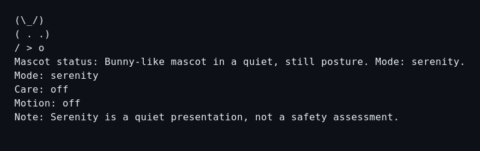
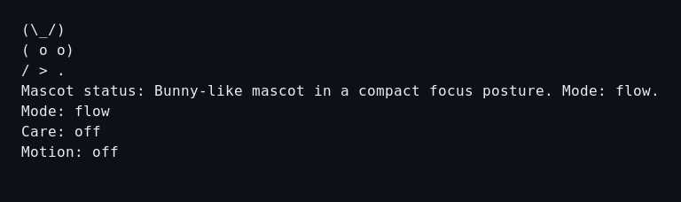
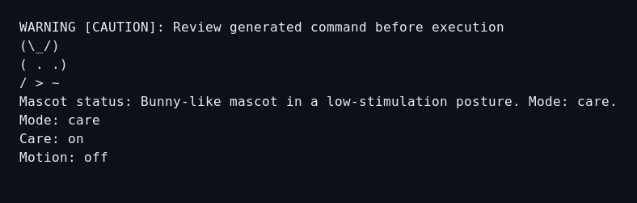
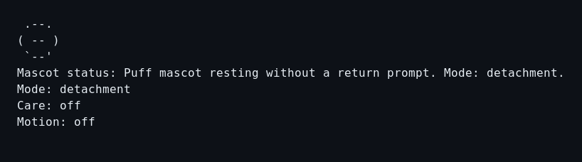
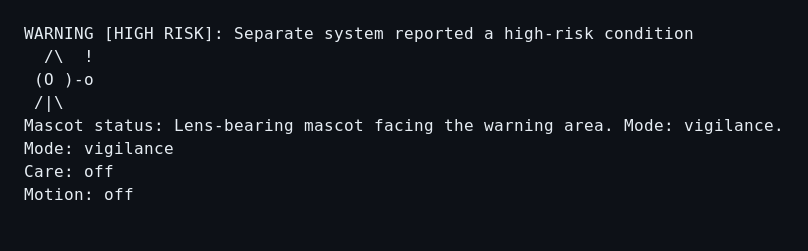
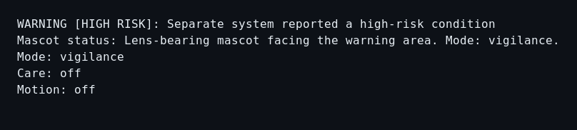

<!-- SPDX-License-Identifier: CC-BY-SA-4.0 -->

# Internal terminal presentation audit — 2026-08-18

## Scope and method

This combined UX, accessibility, and cultural-risk audit covers the current
ASCII output for Bunny/Serenity, Bunny/Flow, Bunny/Care with caution,
Puff/Detachment, the provisionally identified `lens`/Vigilance high-risk path,
and the explicit plain high-risk control. The verbatim `.txt` captures were
regenerated after the audit’s high-priority corrections. The PNGs are retained
as labelled pre-remediation evidence because the local environment no longer
has the original raster renderer available. Colour and Unicode are off.

This is an internal artifact review, not user research, an accessibility
conformance assessment, cultural consultation, or evidence that the interface
is safe. Screen-reader behaviour, terminal wrapping, colour themes, Unicode,
localisation, and human interpretation remain unverified.

## Figma handoff

The editable audit board is
[DOSovoi — Internal Presentation Audit](https://www.figma.com/design/lcNUWVZyVTOoZwHF51x5yT).
It contains the pre-remediation review section, evidence-boundary header, and
six ordered audit cards with health, evidence, and recommendation notes. The
corresponding dark screenshot slots are not yet populated: after the board structure was
created, Figma rejected both the asset uploads and all further file writes
because the connected Starter workspace had reached its MCP tool-call limit.
The six source PNGs and verbatim text captures remain preserved beside this
document. Screenshot placement and final visual verification therefore remain
pending, and the remediation has not been synced to Figma; no claim is made
that the Figma board is complete or current.

## Overall verdict

The warning subsystem now makes the reviewed boundaries literal: unsignalled
states say that no signal and no safety assessment were supplied; supplied
warnings name level, reason, and source; and risk content is separated from
decoration. High-risk state suppresses art by default. The inspection-like lens
shape and label were replaced by a tool-free attentive posture while retaining
the provisional `lens` command identifier for compatibility. Medium-priority
screen-reader copy and Bunny-posture findings were also corrected. Transcript
noise and human evaluation remain open.

## Captured steps

### 1. Serenity — low-semantic resting base

[Current verbatim text capture](01-serenity.txt)

_Pre-remediation raster retained for comparison:_

The quiet state is legible and explicitly says it is not a safety assessment.
The former object/gesture-like lower line is now a symmetrical `(___)` base.

### 2. Flow — universal risk-status line added

[Current verbatim text capture](02-flow.txt)

_Pre-remediation raster retained for comparison:_

Flow is compact and static, and its essential state is textual. It now begins
with the same explicit `none supplied; no safety assessment performed` boundary
as every other unsignalled state.

### 3. Care with caution — healthy warning hierarchy

[Current verbatim text capture](03-care-caution.txt)

_Pre-remediation raster retained for comparison:_

The caution line is first, literal, and independent of colour. Care does not
hide it. `Signal source: explicit user input` and the following blank line make
the risk/decorative subsystem boundary visible.

### 4. Detachment — direct disengagement copy

[Current verbatim text capture](04-detachment.txt)

_Pre-remediation raster retained for comparison:_

The Puff frame is still and restrained, with no invitation to continue. Status
now says `Puff mascot in a resting posture`; it does not mention a return prompt
or duplicate the mode. The universal no-signal/no-assessment line is present.

### 5. Attentive Vigilance with high risk — decoration suppressed

[Current verbatim text capture](05-lens-vigilance-high-risk.txt)

_Pre-remediation raster retained for comparison:_

The warning is first, remains readable without colour, and names explicit user
input as its source. Although the requested preview style is ASCII, high-risk
state suppresses art and retains only `Attentive mascot in a warning-facing
posture`. No lens, probe, inspection action, or competing exclamation mark is
rendered.

### 6. Plain high-risk control — clearest high-risk presentation

[Current verbatim text capture](06-high-risk-plain.txt)

_Pre-remediation raster retained for comparison:_

The explicit plain control and the default high-risk capture are intentionally
equivalent. Both preserve level, reason, source, posture description, mode,
Care, and motion status without competing art.

## Prioritised findings

### Implemented — distinguish “no signal supplied” from “clear/safe” everywhere

Every unsignalled state renders `Risk signal: none supplied; no safety
assessment performed.` The internal variant is `RiskLevel::None`; `signal
clear` remains the explicit user-facing operation that removes stored risk.

### Implemented — remove inspection semantics from the Vigilance mascot

The rendered shape is now tool-free, without lens, probe, pointing limb, or
action mark. Copy says `Attentive mascot in a warning-facing posture`; it does
not say the mascot verifies or inspects. The `lens` identifier remains
provisional compatibility syntax rather than a description of the form.

### Implemented — make high risk decoration-suppressed by default

High risk now forces plain mascot art while keeping descriptive mascot status,
the explicit warning, and source. The explicit plain comparator produces the
same essential presentation.

### Implemented — label signal provenance and visually separate it

Warnings now add `Signal source: explicit user input` and a blank line before
mascot status. Provenance is typed and persisted; future adapters must extend
that type and provide their own inspectable source label and limited result.

### Implemented — simplify screen-reader and status copy

Status describes posture without repeating mode, mode remains on its own line,
and Detachment uses direct resting language. Actual screen-reader announcement
still requires evaluation with representative users and terminal combinations.

### Implemented — simplify Bunny’s lower line

The object/gesture-like variations were replaced with a symmetrical resting
base. Mode differences remain in facial art and literal textual status, without
a depicted object or pointing limb.

### Low — reduce multi-command transcript churn

Every mutating command renders a complete view. A sequence such as `signal
caution` followed by `care on` prints two warning/mascot blocks, first in the old
mode and then in Care. This is deterministic but visually noisy.

Recommendation: consider concise mutation confirmation plus warning text, or an
explicit `--show` option for full rendering. Do not make warning output quiet by
default.

## Confirmed strengths

- Warning level and reason precede decoration in captured caution and high-risk
  states.
- Warning comprehension does not depend on colour, Unicode, animation, or
  expression.
- Care preserves the warning.
- Plain output retains all essential textual state.
- Detachment contains no guilt, dependency, sadness, reward, or return prompt.
- All captured states are static, with motion explicitly off.
- No captured mascot speech claims sentience, authority, inspection, or safety
  knowledge.
- No religious iconography, prayer, blessing, supernatural protection, national
  costume, or hand gesture is explicit in the captures.

## Verification gaps

- No Slavic or other relevant cultural reviewers participated.
- No disabled users or assistive-technology users participated.
- No screen reader, narrow terminal, high zoom, light theme, or non-UTF-8
  terminal was exercised in this visual pass.
- Images show exact text output in a terminal-style raster, not every real
  terminal renderer.
- Symbolic interpretations are reviewer inferences to test, not universal facts.
